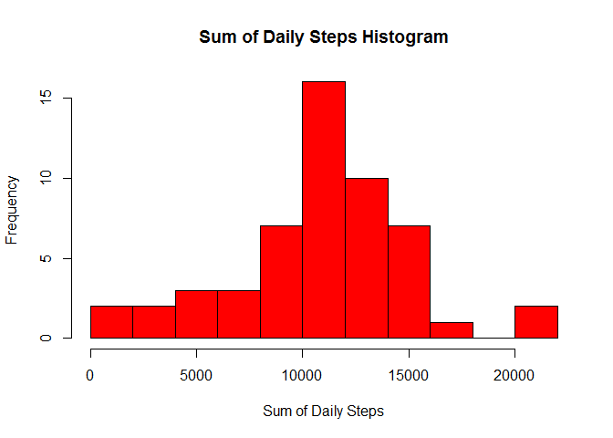
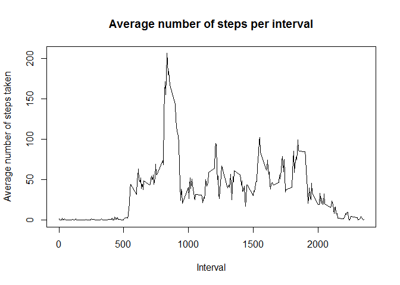
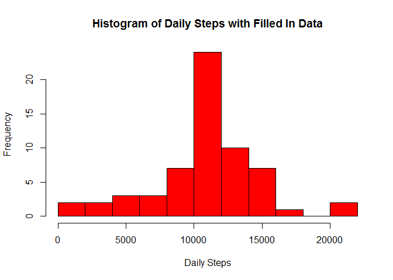

# Reproducible Research Project 1

This project uses data from activity monitoring devices such as a Fitbit, Nike Fuelband, or Jawbone Up. Data consists of the number of steps collected at 5 minutes interval from an anonymous individual during the months of October and November, 2012. Raw data is available at: <https://d396qusza40orc.cloudfront.net/repdata%2Fdata%2Factivity.zip>.

## Loading and preprocessing the data
The steps taken are:
1. download archive
2. unzip archive
3. remove temporary file
4. load data file


```r
fileUrl<-"http://d396qusza40orc.cloudfront.net/repdata%2Fdata%2Factivity.zip"
download.file(fileUrl, destfile="temp.zip")
unzip("temp.zip", files = NULL, list = FALSE, overwrite = TRUE, 
junkpaths = FALSE, unzip = "internal", setTimes = FALSE)
unlink("temp.zip")

activity <- read.csv("activity.csv", header=TRUE)
```

A quick view into the data file content:

```r
head(activity)
```

```
##   steps       date interval
## 1    NA 2012-10-01        0
## 2    NA 2012-10-01        5
## 3    NA 2012-10-01       10
## 4    NA 2012-10-01       15
## 5    NA 2012-10-01       20
## 6    NA 2012-10-01       25
```

The variables included in this dataset are:

1. **steps**: Number of steps taking in a 5-minute interval (missing values are coded as NA)

2. **date**: The date on which the measurement was taken in YYYY-MM-DD format

3. **interval**: Identifier for the 5-minute interval in which measurement was taken

## Total number of steps taken per day
For this part will start with some data preprocessing:

* load libraries that may be needed
* missing values in the dataset will be ignored by removing rows with **steps** values of 'NA'
* resulting data will be converted into a *tbl_df* format 
* the report file will be created by first grouping rows by **date** then computing the sums of **steps** column.


```r
library(dplyr)
library(chron)
library(lattice)

CleanAct <- activity[!is.na(activity$steps), ]
act <- tbl_df(CleanAct)
DailyStepsClean <- summarise(group_by(act, date), SumSteps = sum(steps))
```

1. Total number of steps taken per day

```r
DailyStepsClean
```

```
## Source: local data frame [53 x 2]
## 
##          date SumSteps
## 1  2012-10-02      126
## 2  2012-10-03    11352
## 3  2012-10-04    12116
## 4  2012-10-05    13294
## 5  2012-10-06    15420
## 6  2012-10-07    11015
## 7  2012-10-09    12811
## 8  2012-10-10     9900
## 9  2012-10-11    10304
## 10 2012-10-12    17382
## ..        ...      ...
```

2. Histogram of the total number of steps taken each day

```r
hist(DailyStepsClean$SumSteps, breaks=10, main = "Sum of Daily Steps Histogram", col="red", xlab="Sum of Daily Steps")
```

 

3. Mean of the total number of steps taken per day

```r
MeanDailyStepsClean <- summarise(group_by(act, date), MeanSteps = mean(steps))
summary(MeanDailyStepsClean)
```

```
##          date      MeanSteps      
##  2012-10-02: 1   Min.   : 0.1424  
##  2012-10-03: 1   1st Qu.:30.6979  
##  2012-10-04: 1   Median :37.3785  
##  2012-10-05: 1   Mean   :37.3826  
##  2012-10-06: 1   3rd Qu.:46.1597  
##  2012-10-07: 1   Max.   :73.5903  
##  (Other)   :47
```

```r
head(MeanDailyStepsClean)
```

```
## Source: local data frame [6 x 2]
## 
##         date MeanSteps
## 1 2012-10-02   0.43750
## 2 2012-10-03  39.41667
## 3 2012-10-04  42.06944
## 4 2012-10-05  46.15972
## 5 2012-10-06  53.54167
## 6 2012-10-07  38.24653
```

4. Median of the total number of steps taken per day

```r
MedianDailyStepsClean <- summarise(group_by(act, date), MeanSteps = median(steps))
summary(MedianDailyStepsClean)
```

```
##          date      MeanSteps
##  2012-10-02: 1   Min.   :0  
##  2012-10-03: 1   1st Qu.:0  
##  2012-10-04: 1   Median :0  
##  2012-10-05: 1   Mean   :0  
##  2012-10-06: 1   3rd Qu.:0  
##  2012-10-07: 1   Max.   :0  
##  (Other)   :47
```

```r
head(MedianDailyStepsClean)
```

```
## Source: local data frame [6 x 2]
## 
##         date MeanSteps
## 1 2012-10-02         0
## 2 2012-10-03         0
## 3 2012-10-04         0
## 4 2012-10-05         0
## 5 2012-10-06         0
## 6 2012-10-07         0
```

## Average daily activity pattern

1. Time series plot of the 5-minute interval (x-axis) and the average number of steps taken, averaged across all days (y-axis)


```r
IntervalStepsClean <- summarise(group_by(act, interval), IntervalMeanSteps = mean(steps))
plot(IntervalStepsClean$interval, IntervalStepsClean$IntervalMeanSteps, type= 'l', ylab="Average number of steps taken", xlab="Interval", main="Average number of steps per interval")
```

 

2. Which 5-minute interval, on average across all the days in the dataset contains the maximum number of steps?

```r
# IntervalStepsClean <- summarise(group_by(act, interval), IntervalMeanSteps = mean(steps))
IntervalStepsClean[which(IntervalStepsClean$IntervalMeanSteps == max(IntervalStepsClean$IntervalMeanSteps)), ]
```

```
## Source: local data frame [1 x 2]
## 
##   interval IntervalMeanSteps
## 1      835          206.1698
```

## Inputting Missing Values

There are a number of days/intervals where there are missing values (coded as NA). The presence of missing days may introduce bias into some data calculations or summaries.

1. Calculate and report the total number of missing values in the dataset

```r
length(activity[is.na(activity$steps), 1])
```

```
## [1] 2304
```

2. Create a new dataset that is equal to the original dataset but with the missing data filled in with the interval mean over all days in the set.


```r
FilledAct <- activity
for (row in 1:length(activity[, 1])) {
  if (is.na(activity[row, 'steps'])) {
    FilledAct[row, 'steps'] = IntervalStepsClean[which(IntervalStepsClean[ ,'interval'] == activity[row, 'interval']), 'IntervalMeanSteps']
  }
}
```

3. Histogram of the total number of steps taken each day 

```r
DailyStepsFilled <- summarise(group_by(FilledAct, date), SumSteps = sum(steps))
hist(DailyStepsFilled$SumSteps, breaks=10, main = "Histogram of Daily Steps with Filled In Data", 
  col="red", xlab="Daily Steps")
```

 

4. Calculate and report the mean total number of steps taken per day. 

```r
MeanDailyStepsFilled <- summarise(group_by(FilledAct, date), MeanSteps = mean(steps))
head(MeanDailyStepsFilled)
```

```
## Source: local data frame [6 x 2]
## 
##         date MeanSteps
## 1 2012-10-01  37.38260
## 2 2012-10-02   0.43750
## 3 2012-10-03  39.41667
## 4 2012-10-04  42.06944
## 5 2012-10-05  46.15972
## 6 2012-10-06  53.54167
```

5. Calculate and report the median total number of steps taken per day. 

```r
MedianDailyStepsFilled <- summarise(group_by(FilledAct, date), MeanSteps = median(steps))
head(MedianDailyStepsFilled)
```

```
## Source: local data frame [6 x 2]
## 
##         date MeanSteps
## 1 2012-10-01  34.11321
## 2 2012-10-02   0.00000
## 3 2012-10-03   0.00000
## 4 2012-10-04   0.00000
## 5 2012-10-05   0.00000
## 6 2012-10-06   0.00000
```

6. Do these values differ from the estimates from the first part of the assignment?

Apparently there are two types of differences:  

* The Filled In data set has values for all days compared to he Clean data set  
* Individual values differ somehow  

What is the impact of imputing missing data on the estimates of the total daily number of steps?

* By comparing the two histograms the values appear more concentrated towards the average
* If approximated by a normal distribution the standard deviation appears smaller fot the Filled In data set

## Are there differences in activity patterns between weekdays and weekends?

1. Create a new factor variable in the dataset with two levels - "weekday" and "weekend" indicating whether a given date is a weekday or weekend day.

The data has been first grouped by day type and interval then summarised by taken the mean of steps.

```r
DaytypeFilledAct <- cbind(FilledAct, is.weekend(as.Date(FilledAct$date)))
names(DaytypeFilledAct)[4] <- 'Daytype'

MeanIntervalStepsFilled <- summarise(group_by(DaytypeFilledAct, Daytype, interval), MeanSteps = mean(steps))
MeanIntervalStepsFilled$Daytype <- factor(MeanIntervalStepsFilled$Daytype)
levels(MeanIntervalStepsFilled$Daytype) <- c('Weekday', 'Weekend')
```

2. Time series panel plot of the 5-minute interval (x-axis) and the average number of steps taken, averaged across all weekday days or weekend days (y-axis). 


```r
xyplot(MeanSteps ~ interval | Daytype, type='l', data = MeanIntervalStepsFilled, xlab = "Interval", ylab = "Number of steps", layout=c(1,2))
```

 
